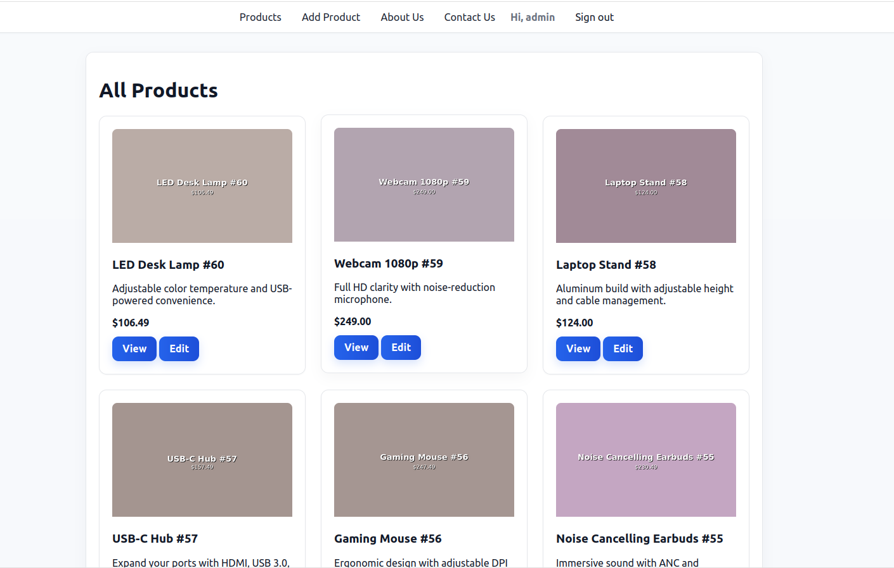
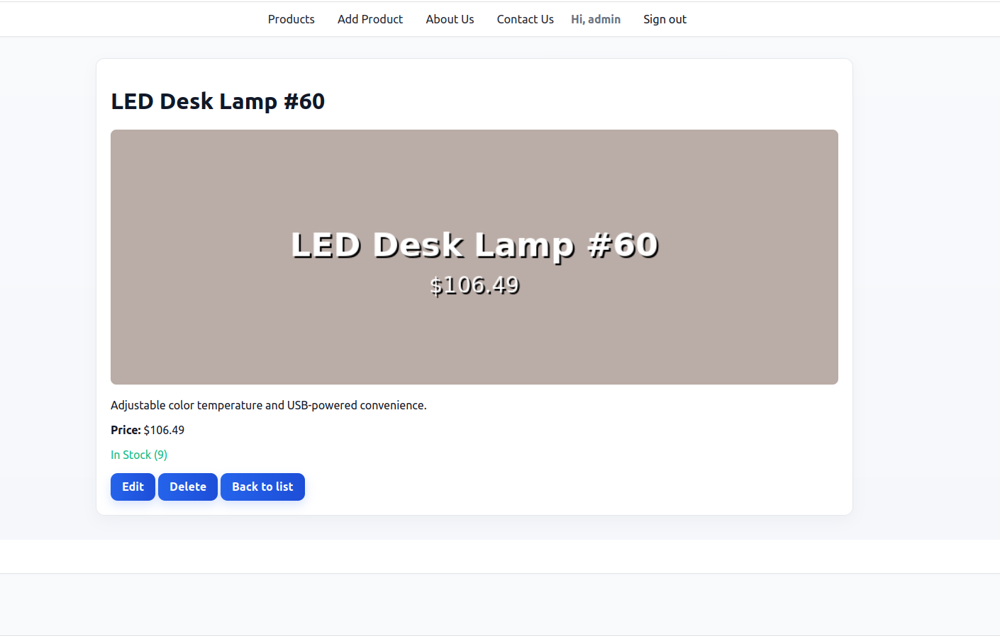
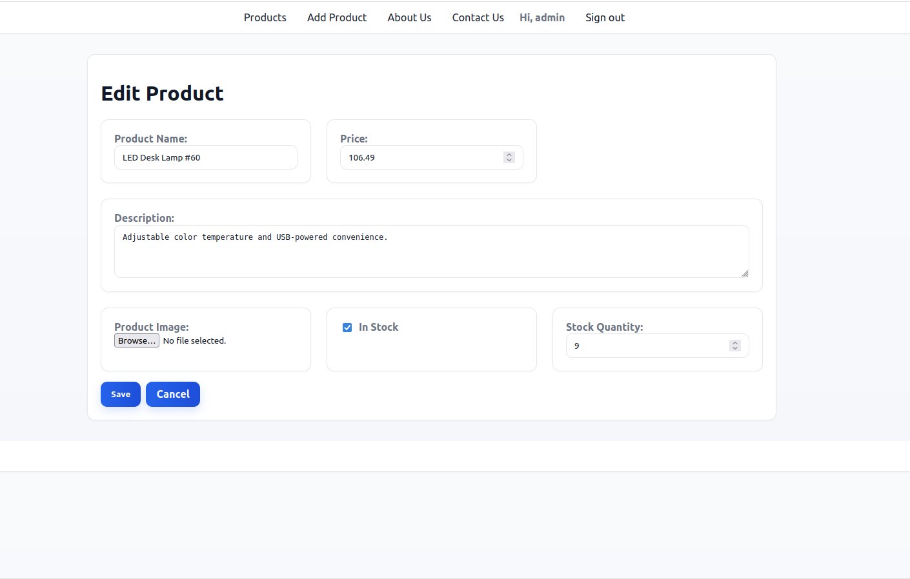
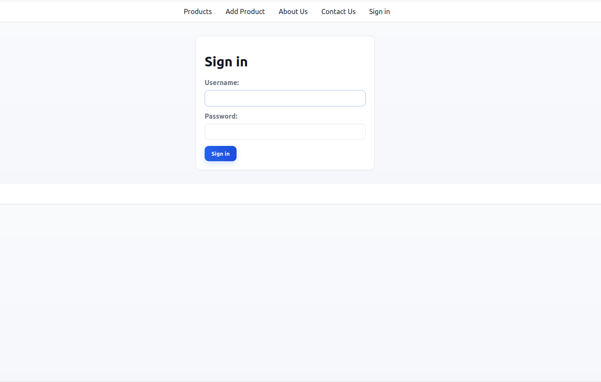

# marketPlace (Django) — Lab Submission Guide

A concise guide to run, verify, and showcase the project.

---

## Setup
```bash
python3 -m venv .venv && source .venv/bin/activate
pip install -U pip
pip install Django Pillow
python3 manage.py migrate
python3 manage.py createsuperuser
python3 manage.py runserver
```

Database: SQLite by default (configured in `marketPlace/settings.py`).

---

## URLs
- Home: `http://127.0.0.1:8000/`
- Products list: `http://127.0.0.1:8000/list/`
- Product create: `http://127.0.0.1:8000/create/` (login required)
- Product detail: `http://127.0.0.1:8000/<id>/`
- Product edit: `http://127.0.0.1:8000/<id>/edit/` (login required)
- Product delete: `http://127.0.0.1:8000/<id>/delete/` (login required)
- Admin: `http://127.0.0.1:8000/admin/`

---

## Features
- Product model with: name, price, description, image, in_stock, stock_quantity, created_at, updated_at, unique code.
- CRUD for products using Django views and ModelForms.
- Template inheritance via `templates/base.html`; named URLs used in templates.
- Professional, clean UI in `static/styles.css`.

---

## Demo Data (optional)
```bash
python3 manage.py seed_products --flush --count 24
python3 manage.py seed_product_images --overwrite
```

---

## Admin Verification
Login at `/admin/` and verify Products appear with list display, filters, search, and read-only timestamps.

---

## Screenshots








